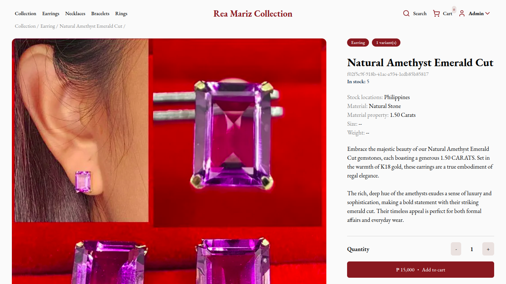

# Virtual Storefront Platform

A virtual storefront for a jewelry wholesaler based in Japan. Explore exquisite jewelry collections and experience the convenience of virtual wholesale shopping. 
* See live at - [https://rea-mariz-collection.vercel.app](https://rea-mariz-collection.vercel.app)
* A course requirement CS Elective 2
## User interface

## Technologies used
This project is built on cutting-edge technologies to provide a modern and efficient platform for both customers and wholesalers.
Technologies Used

* React.js: A JavaScript library for building user interfaces, React.js powers the dynamic and interactive components of our virtual storefront.

* Next.js: Building on React, Next.js enables server-side rendering and delivers optimized performance, providing a seamless user experience.

* ShadcnUI: ShadcnUI is a custom UI component library that adds a touch of elegance to the storefront, ensuring a visually appealing and cohesive design.

* TailwindCSS: TailwindCSS is used for styling, offering utility-first classes to create a responsive and well-designed user interface.

* Supabase: As the backend solution, Supabase is leveraged for its scalability and ease of use, managing product information and user data efficiently.
